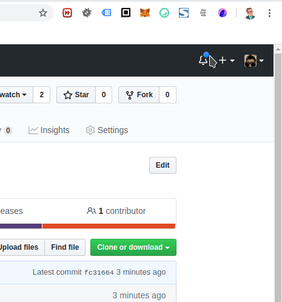

Browser Extension for MARBLE.CARDS
======

This is a browser extension for the Cryptocurrency Collectables [Marble.Cards](https://marble.cards/).

What are Marble cards, anyway?
------

- It’s a way to create and trade unique digital cards based on URLs
- Every web page can only be marbled once and by one person only
- Once a card is created, that URL is claimed forever
- All Marble cards are non-fungible tokens built on Ethereum

[More about Marble.Cards](https://marble.cards/)

What does the Browser Extension do?
------

The Browser Extension helps you to create Marble Cards. The problem is, URLs are often assigned.
To check a URL you usually have to go to the Marble Card https://marble.cards/ website and check if a URL is out of stock.

With this Browser Extension this back and forth is over.

